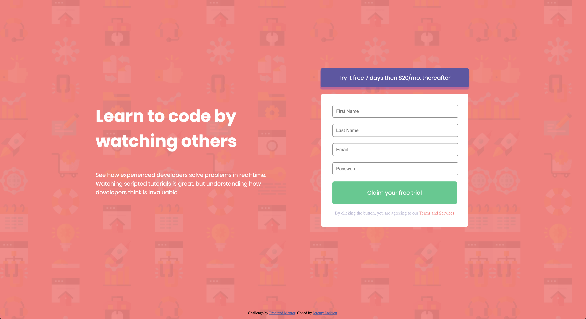

# IntroComponentWithSignUpForm

Courtesy of frontendmentor.io.

A simple landing page with all design/image files provided by frontendmentor.io

The goal of this project was to replicate the design of the landing page provided in the project files to be fully responsive and accessible on either desktop or mobile platforms. The first step was to replicate the desktop orientation as faithfully as possible, and the next step will be to ensure it remains formatted correctly when viewed on mobile.

**Desktop Goal:**

**My Recreation:**

